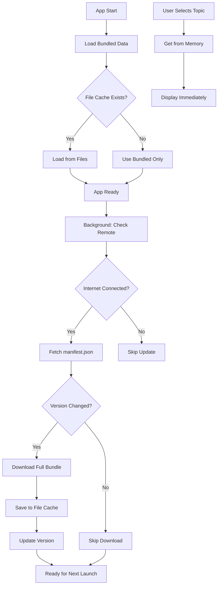

# Knowledge Tree Loading Architecture

## Overview

SDSA uses a simple, efficient approach to knowledge tree loading:
1. **App ships with complete default knowledge trees** - Users can start immediately
2. **Background sync from remote repository** - Updates cached when online
3. **All trees loaded at once** - No per-question fetching, everything is pre-loaded

## Data Source Strategy

### Simple Priority Chain
1. **File Cache** - If exists, use the latest downloaded version
2. **Bundled Assets** - Default trees shipped with the app (always available)

Remote fetching happens in background and updates the cache for next app launch.

## Knowledge Tree Structure

### YAML Format - Complete Example

```yaml
id: 'e2e-testing'
title: 'End-to-End Testing Setup'
description: 'Guide for setting up comprehensive E2E testing'
initial_question: 'Do you have an existing test system?'

# Each "paths" key represents a possible answer to the current question
# The structure creates a decision tree that branches based on user choices
paths:
  # First level: Answer to initial_question
  yes:
    question: 'Which framework are you currently using?'
    options: ['cypress', 'playwright', 'selenium', 'other']
    # Each option becomes a path in the next level
    paths:
      cypress:
        question: 'What version of Cypress?'
        options: ['v13+', 'v12', 'older']
        paths:
          'v13+':
            question: 'Do you need component testing too?'
            options: ['yes', 'no']
            paths:
              yes:
                # Terminal node - no more questions
                resources: 
                  - 'cypress-v13-component-testing.md'
                  - 'cypress-best-practices.md'
                summary: 'Great! You have the latest Cypress with component testing.'
              no:
                resources: 
                  - 'cypress-v13-e2e-only.md'
                summary: 'Latest Cypress configured for E2E testing only.'
          'v12':
            question: 'Planning to upgrade?'
            options: ['yes', 'no']
            resources: 
              - 'cypress-v12-migration-guide.md'
          'older':
            resources: 
              - 'cypress-urgent-upgrade.md'
              - 'cypress-security-patches.md'
            summary: 'You should upgrade Cypress immediately for security fixes.'
      
      playwright:
        question: 'Which browsers do you test?'
        options: ['all-browsers', 'chromium-only', 'webkit-focus']
        paths:
          'all-browsers':
            question: 'Do you run tests in parallel?'
            options: ['yes', 'no']
            paths:
              yes:
                resources:
                  - 'playwright-parallel-optimization.md'
                  - 'playwright-sharding-guide.md'
              no:
                resources:
                  - 'playwright-parallel-setup.md'
                  - 'playwright-ci-speedup.md'
          'chromium-only':
            resources:
              - 'playwright-cross-browser-benefits.md'
          'webkit-focus':
            resources:
              - 'playwright-safari-specific-testing.md'
      
      selenium:
        question: 'Using Selenium Grid?'
        options: ['yes', 'no', 'considering']
        resources:
          - 'migrate-from-selenium-to-playwright.md'
        paths:
          yes:
            resources:
              - 'selenium-grid-optimization.md'
          no:
            resources:
              - 'selenium-grid-setup.md'
          considering:
            question: 'What is your main concern?'
            options: ['cost', 'complexity', 'maintenance']
            resources:
              - 'selenium-grid-decision-guide.md'
      
      other:
        question: 'Please specify your testing framework'
        # Free text input - special handling needed
        input_type: 'text'
        resources:
          - 'e2e-framework-comparison.md'
  
  # First level: Alternative answer to initial_question  
  no:
    question: "What's your primary application type?"
    options: ['web', 'mobile', 'desktop', 'api']
    paths:
      web:
        question: 'What is your frontend framework?'
        options: ['react', 'vue', 'angular', 'vanilla']
        paths:
          react:
            question: 'Using Next.js?'
            options: ['yes', 'no']
            paths:
              yes:
                question: 'App Router or Pages Router?'
                options: ['app-router', 'pages-router']
                paths:
                  'app-router':
                    resources:
                      - 'nextjs-app-router-e2e-setup.md'
                      - 'playwright-nextjs-app-router.md'
                  'pages-router':
                    resources:
                      - 'nextjs-pages-e2e-setup.md'
                      - 'cypress-nextjs-pages.md'
              no:
                question: 'Create React App or Vite?'
                options: ['cra', 'vite', 'custom']
                resources:
                  - 'react-e2e-getting-started.md'
          
          vue:
            question: 'Vue 2 or Vue 3?'
            options: ['vue3', 'vue2']
            resources:
              - 'vue-testing-library.md'
          
          angular:
            resources:
              - 'angular-e2e-protractor-migration.md'
              - 'angular-playwright-setup.md'
          
          vanilla:
            resources:
              - 'vanilla-js-e2e-simple-setup.md'
      
      mobile:
        question: 'Native or React Native?'
        options: ['native-ios', 'native-android', 'react-native', 'flutter']
        paths:
          'react-native':
            question: 'Using Expo?'
            options: ['expo-managed', 'expo-bare', 'plain-rn']
            resources:
              - 'detox-react-native-setup.md'
          'native-ios':
            resources:
              - 'xctest-ui-setup.md'
          'native-android':
            resources:
              - 'espresso-setup.md'
          'flutter':
            resources:
              - 'flutter-integration-testing.md'
      
      desktop:
        question: 'Which desktop framework?'
        options: ['electron', 'tauri', 'native']
        resources:
          - 'desktop-e2e-challenges.md'
      
      api:
        question: 'REST or GraphQL?'
        options: ['rest', 'graphql', 'both']
        resources:
          - 'api-testing-vs-e2e-testing.md'
          - 'postman-newman-setup.md'

# Context variables collected during the journey
# These are passed to the AI chat for personalized assistance
context_variables:
  - has_test_system
  - current_framework
  - framework_version
  - app_type
  - frontend_framework
  - needs_migration
  - browsers_tested
  - parallel_execution
  - ci_integration

# Metadata for the knowledge block
metadata:
  author: 'SDSA Team'
  version: '1.2.0'
  last_updated: '2024-12-15'
  estimated_time: '10-15 minutes'
  difficulty: 'intermediate'
  tags: ['testing', 'e2e', 'automation']
```

### How the YAML Structure Works:

1. **Each question leads to paths** - User's answer becomes a key in `paths:`
2. **Paths can have sub-paths** - Creates deeper branches in the decision tree
3. **Terminal nodes** - When there's no more `question:`, journey ends with `resources:` and/or `summary:`
4. **Resources can appear anywhere** - Can be attached to any node, not just terminals
5. **Context accumulates** - Each answer adds to the context for AI chat
6. **Options define UI** - The `options:` array becomes buttons/choices in the UI
7. **Special input types** - Can handle free text input with `input_type: 'text'`

### TypeScript Types
```typescript
interface KnowledgeBlock {
  id: string;
  title: string;
  initial_question: string;
  paths: Record<string, Path>;
  context_variables?: string[];
}

interface Path {
  question?: string;
  options?: string[];
  next?: string;
  resources?: string[];
}
```

## Implementation Architecture

### 1. Bundled Knowledge Structure
```
assets/
└── knowledge/
    ├── catalog.json          # List of available topics
    ├── blocks/
    │   ├── e2e-testing.yaml
    │   ├── react-setup.yaml
    │   ├── ci-cd.yaml
    │   └── docker.yaml
    └── resources/
        ├── getting-started-with-e2e.md
        ├── cypress-guide.md
        └── playwright-setup.md
```

### 2. Simplified Service Architecture

#### KnowledgeService (Single Service)
```typescript
class KnowledgeService {
  private fileCache: Map<string, any> = new Map();
  private bundledData: Map<string, any> = new Map();
  
  async initialize() {
    // Load all bundled data on app start
    await this.loadBundledData();
    // Load cached data if exists
    await this.loadCachedData();
    // Trigger background sync
    this.backgroundSync();
  }
  
  getBlock(blockId: string): KnowledgeBlock {
    // Try file cache first, then bundled
    return this.fileCache.get(blockId) || this.bundledData.get(blockId);
  }
  
  private async backgroundSync() {
    // Fetch all data from remote
    // Save to file system
    // Update cache for next launch
  }
}
```

### 3. Topic Discovery System

#### Catalog Structure
```json
{
  "version": "1.0.0",
  "updated": "2025-09-05T00:00:00Z",
  "topics": [
    {
      "id": "e2e-testing",
      "title": "End-to-End Testing",
      "description": "Set up comprehensive E2E testing",
      "category": "testing",
      "difficulty": "intermediate",
      "estimatedTime": "15 mins",
      "blockId": "e2e-testing"
    },
    {
      "id": "react-setup",
      "title": "React Project Setup",
      "description": "Configure a new React project",
      "category": "frontend",
      "difficulty": "beginner",
      "estimatedTime": "10 mins",
      "blockId": "react-setup"
    }
  ]
}
```

#### TopicService
- Fetches catalog from remote or bundled source
- Filters and sorts topics
- Provides search functionality
- Tracks topic popularity and usage

### 4. Simple Caching Strategy

#### Two-Layer Cache
1. **Memory Map** - All knowledge blocks loaded in memory on app start
2. **File System** - Downloaded updates stored as files

#### No Complex Keys
- Simple file names: `e2e-testing.yaml`, `react-setup.yaml`
- One catalog file: `catalog.json`
- Resources in folders: `resources/getting-started.md`

### 5. Simplified Loading Flow



### 6. Version-Based Sync Mechanism

#### Manifest File (in sdsa.team repo)
```json
{
  "version": "2024.12.15.1",
  "updated": "2024-12-15T10:30:00Z",
  "size": "245KB",
  "blocks": {
    "e2e-testing": "1.0.0",
    "react-setup": "1.2.0",
    "ci-cd": "1.1.0",
    "docker": "2.0.0"
  }
}
```

#### Smart Update Check
```typescript
class KnowledgeService {
  private currentVersion: string = null;
  
  async checkForUpdates(): Promise<boolean> {
    // 1. Fetch only the manifest.json (small file)
    const manifest = await fetch(`${REMOTE_URL}/manifest.json`);
    
    // 2. Compare versions
    if (manifest.version === this.currentVersion) {
      return false; // No update needed
    }
    
    // 3. Download full bundle only if version changed
    await this.downloadFullBundle();
    this.currentVersion = manifest.version;
    return true;
  }
}
```

#### Sync Process
1. Fetch lightweight manifest file (< 1KB)
2. Compare version with stored version
3. If different, download full knowledge bundle
4. Save new version to storage
5. No download if version unchanged

### 7. Error Handling

#### Network Failures
- Automatic fallback to cache/bundled
- Retry with exponential backoff
- User notification for persistent failures

#### Parsing Errors
- Validate YAML structure
- Schema validation with Joi/Yup
- Graceful degradation to previous version

#### Missing Resources
- Placeholder content
- Link to online version
- Request queuing for retry

## File System Access

### React Native Asset Loading

#### For Bundled YAML Files
```typescript
import { Asset } from 'expo-asset';

async function loadBundledYAML(path: string): Promise<string> {
  const asset = Asset.fromModule(require(`../assets/knowledge/${path}`));
  await asset.downloadAsync();
  const response = await fetch(asset.uri);
  return response.text();
}
```

#### For Dynamic Loading
```typescript
import * as FileSystem from 'expo-file-system';

async function loadFromFileSystem(path: string): Promise<string> {
  const fileUri = `${FileSystem.documentDirectory}knowledge/${path}`;
  return FileSystem.readAsStringAsync(fileUri);
}
```

## Migration Path

### Phase 1: Bundled Content (MVP)
- Ship with 4-5 essential knowledge blocks
- Basic topic catalog
- No remote fetching

### Phase 2: Remote Integration
- Enable GitHub fetching
- Add caching layer
- Background sync

### Phase 3: Community Features
- User contributions via PRs
- Rating and feedback
- Custom knowledge trees

### Phase 4: Advanced Features
- Personalized recommendations
- Learning paths
- Progress tracking
- Analytics

## Security Considerations

### Content Validation
- YAML sanitization
- Resource URL validation
- Size limits for blocks
- Rate limiting for fetches

### Privacy
- No user tracking in MVP
- Local-only journey history
- Opt-in telemetry (future)

## Performance Optimization

### Bundle Size
- Lazy load knowledge blocks
- Compress YAML files
- Optimize resource images

### Runtime Performance
- Memory cache with LRU eviction
- Prefetch next likely blocks
- Progressive resource loading

### Network Optimization
- HTTP/2 for parallel fetches
- ETag support for caching
- Delta updates (future)

## Testing Strategy

### Unit Tests
- Repository implementations
- Cache operations
- YAML parsing
- Fallback logic

### Integration Tests
- Full loading flow
- Offline scenarios
- Sync mechanism
- Error recovery

### E2E Tests
- Topic selection
- Journey completion
- Resource viewing
- Offline mode

## Development Setup

### Local Testing
```bash
# Start with mock data
KNOWLEDGE_SOURCE=mock yarn start

# Use bundled assets
KNOWLEDGE_SOURCE=bundled yarn start

# Use remote (requires sdsa.team repo)
KNOWLEDGE_SOURCE=remote yarn start
```

### Adding New Knowledge Blocks
1. Create YAML file in `assets/knowledge/blocks/`
2. Add resources to `assets/knowledge/resources/`
3. Update `catalog.json`
4. Test loading flow
5. Submit PR to main repo

## Future Enhancements

### Version 2.0
- Knowledge block dependencies
- Conditional paths based on context
- Multi-language support
- Rich media resources

### Version 3.0
- AI-generated knowledge blocks
- Collaborative editing
- Real-time updates
- Federation support

## API Reference

### KnowledgeService

```typescript
class KnowledgeService {
  // Fetch a knowledge block
  fetchKnowledgeBlock(blockId: string): Promise<KnowledgeBlock>
  
  // Fetch a resource
  fetchResource(resourcePath: string): Promise<string>
  
  // Get available topics
  getTopics(): Promise<Topic[]>
  
  // Check for updates
  checkForUpdates(): Promise<UpdateInfo>
  
  // Force sync
  syncKnowledge(): Promise<void>
  
  // Clear cache
  clearCache(): Promise<void>
}
```

### TopicService

```typescript
class TopicService {
  // Get all topics
  getAllTopics(): Promise<Topic[]>
  
  // Get topic by ID
  getTopic(topicId: string): Promise<Topic>
  
  // Search topics
  searchTopics(query: string): Promise<Topic[]>
  
  // Get topics by category
  getTopicsByCategory(category: string): Promise<Topic[]>
  
  // Get popular topics
  getPopularTopics(limit: number): Promise<Topic[]>
}
```

## Monitoring & Analytics

### Metrics to Track (Post-MVP)
- Block load times
- Cache hit rates
- Sync frequency
- Error rates
- Popular topics
- Journey completion rates

### Error Reporting
- Sentry integration
- Custom error boundaries
- Fallback UI states
- User feedback mechanism

## Conclusion

This architecture provides a robust, offline-first approach to loading knowledge trees while maintaining flexibility for future enhancements. The fallback chain ensures users always have access to content, while the sync mechanism keeps content fresh when connectivity is available.